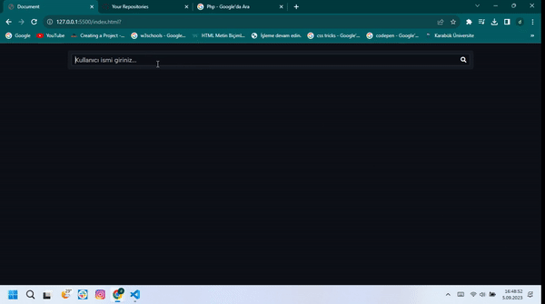

# Axios
HTML, CSS ve JavaScript temelli ve Axios kullanarak GitHub Profil Kartı uygulaması

## Kurulum

1. Github'dan indiriniz...
2. Zip halinden çıkarınız...
3. Tarayıcı ve internet yardımıyla kullanabilir ve githubdan veri alabilirsiniz...

## İletişim

Sorularınız için bana durmusozgul66@gmail.com adresinden ulaşabilirsiniz.

<h2>Uygulamanın Ekran Görüntüsü</h2>

